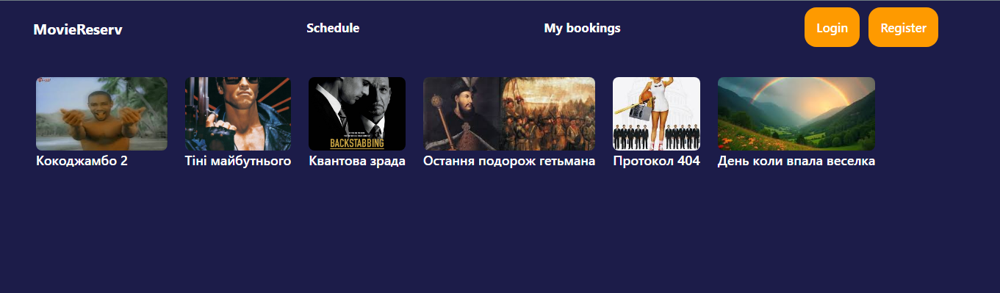
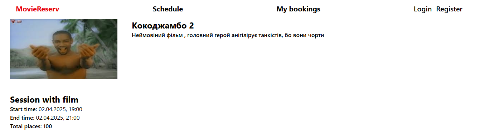
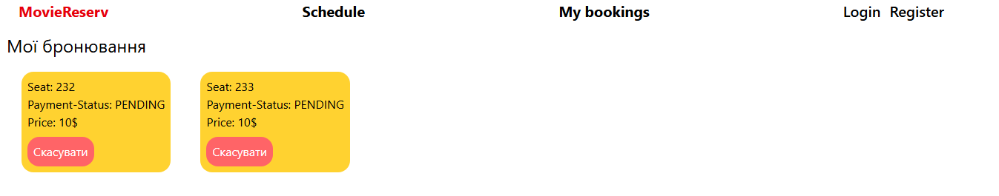
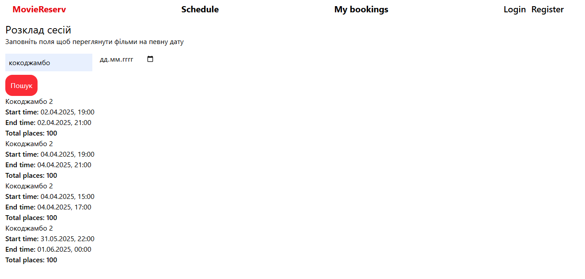
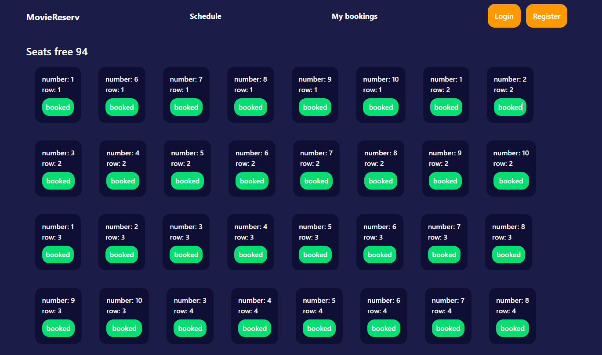

# 🎬 Movie Reserv App (Client)

Це фронтенд-застосунок для онлайн-сервісу бронювання квитків у кінотеатр. Користувачі можуть реєструватися, входити, переглядати фільми, бронювати місця на сеанси, а також керувати своїми бронюваннями. Весь функціонал взаємодіє з власноруч створеним REST API.

---

## 🚀 Стек технологій

- **React** – бібліотека для створення UI  
- **Redux Toolkit** – менеджмент глобального стану  
- **Tailwind CSS** – швидка стилізація компонентів  
- **React Router** – маршрутизація  
- **Axios** – запити до API  
- **JWT** – авторизація (токен зберігається в localStorage)

---

## 🔑 Основні можливості

- 🔐 Реєстрація та логін користувача (JWT)
- 🎞️ Перегляд списку фільмів
- 🕒 Перегляд доступних сеансів по кожному фільму
- 💺 Бронювання місць на конкретний сеанс
- 📂 Перегляд своїх бронювань
---

## 🧱 Сторони проєкту

- ✅ **Frontend (цей репозиторій):**  
  SPA, реалізований на React + Redux Toolkit + Tailwind CSS

- ⚙️ **Backend (окремий репозиторій):**  
  API на Node.js / NestJS + Prisma + PostgreSQL  
  👉 [Посилання на бекенд](https://github.com/BogdanVituk/Movie_Reserv_System)

---

## 📸 Скріншоти

| Головна| Фільм  | Бронювання | Розклад    | Місця |
|--------|--------|------------|------------|------------|-----------|
|  |  |   | |  | |  |

---

## ⚙️ Як запустити локально

```bash
git clone https://github.com/BogdanVituk/Movie-Reserv-App-Client-.git
cd movie-client
npm install
npm run dev
